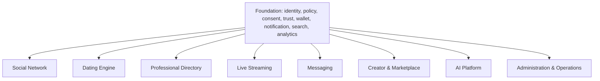

# Platform Capability Map

Foundation capabilities expose stable contracts. Experience modules may consume them but never own another module’s records or bypass safety, consent, jurisdiction, or payment controls.
