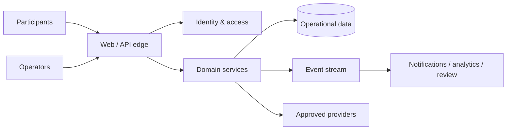

# System Context

ESEP is a web and API platform serving participants, operators, and approved third-party providers. A boundary service authenticates requests; domain services own business operations; asynchronous processing handles notifications, analytics, and long-running review work.

Providers receive only the minimum data required for their contractual purpose. Every integration has an owner, failure mode, and revocation path.
