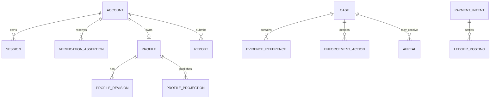

# Relationship Map

Cross-domain references use stable opaque IDs. Foreign-key enforcement is used where it does not violate domain boundaries; otherwise, referential integrity is maintained through validated commands and reconciliation.
